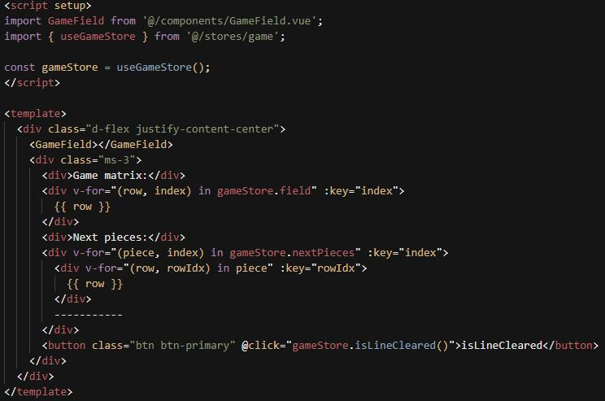
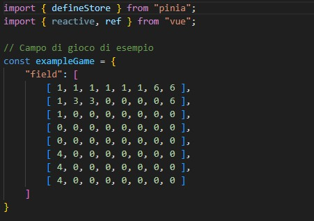
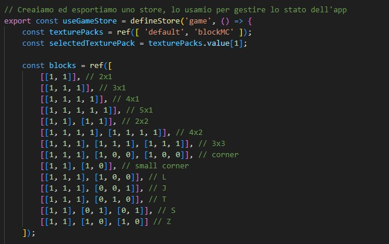

# Docs

*Romagnoli, Petrino - 5F ITT Blaise Pascal*

## Introduzione

Questo documento fornisce una panoramica tecnica e stilista del progetto "Bust-a-Bloq", un applicativo sviluppato utilizzando Vue.js come framework e le capacità grafiche della libreria Javascript Pixi.js.

## Tecnologie utilizzate
- Vue.js: framework HTML e Javascript usato per la creazione delle pagine web del sito
- Pixi.js: libreria grafica Javascript usata per visualizzare il campo di gioco
- Websocket: usati per trasmettere lo stato della partita e le varie richieste real-time al server
- Firebase: usato per le funzionalità di login e come database

## Feature programmate
- [x] Campo di gioco
- [ ] Menù principale
- [ ] AI generazione blocchi
- [ ] Multiplayer
- [ ] Lista Amici
- [ ] Partite private
- [ ] Inviti alle partite
- [ ] Pelli per i blocchi
- [ ] Pagina about

## Struttura del codice

Il progetto è stato creato utilizzando l'architettura fornita da Vue.js, sfruttando sia componenti che view offerte dal framework stesso e, in aggiunta ad esse, usando un sistema di stores offerto da Pinia per gestire lo stato corrente della partita.
Le texture dei vari blocchi di gioco sono salvate in locale, ma non è impossibile pensare ad un espansione futura con l'utilizzo di un database non-relazionale.

## Funzionalità
- **Campo di gioco:** Il campo di gioco deve adattarsi alle dimensioni dello schermo.
- **Generazione blocchi con AI:** Il sistema deve riconoscere quali blocchi possono adattarsi allo tato attuale della partita, permettendo al giocatore di progredire.
- **Multiplayer:** Il gioco offre funzionalità multiplayer per partite 1 contro 1 o con molteplici giocatori.
- **Lista Amici:** Il gioco permette di avere una lista di amici per facilitare l'invito a delle partite amichevoli o chattare.
- **Partite private:** Possibilità di creare lobby personalizzate per partite organizzate con amici oppure tornei.
- **Inviti alle partite:** Si possono invitare altri giocatori ad una lobby tramite un codice/link.
- **Pelli per i blocchi:** Capacità di sbloccare nuovi aspetti per i blocchi ed il campo di gioco aumentando di livello.

## Descrizione gioco
*Inserire screenshot del gioco (quando abbiamo implementato il campo)*

### In cosa consiste il gioco?
*Inserire qui nome gioco in WIP* è un gioco che consiste nell'eliminare il maggior numero di blocchi possibile dal campo di gioco senza rimanere senza spazio per inserirne di nuovi.

### Come si eliminano i blocchi?
Per distruggere i vari blocchi dal campo di gioco, bisogna formare una linea (Orizzontale o verticale) di blocchi che vada da un lato all'altro del campo. Fare ciò distruggerà tutti i blocchi appartenenti a quella linea. In caso si elimini più di una linea con un blocco solo si accumuleranno punti extra.

### Che tipologie di blocchi esistono?
Al contrario di altre tipologie di giochi simile (*es. Tetris*), i blocchi di (*Inserire WIP*) non sono generati in maniera casuale, ma vengono invece adattati per permettere sempre al giocatore di avanzare nella partita se è in grado di individuare la combinazione di blocchi giusta per proseguire. I blocchi sono di svariate forme e non sono limitati ad uno specifico numero di quadretti.

## Potenziali miglioramenti
- Vorremmo che il gioco possa essere il più fluido e soddisfacente possibile, offrendo al giocatore delle animazioni fluide che possano miglioare l'esperienza del giocatore, fornendo informazioni chiare sullo stato della partità.

- Classifiche online basate sulla regione di gioco e classifiche contenenti solo gli amici del giocatore, in modo da confrontare indirettamente i traguardi conseguiti durante le partite.

- Possibilità di accesso utilizzando Social Media, per permettere un Login più veloce per iniziare a giocare subito con altre persone online, magari conservando alcune caratteristiche del profilo come la posizione in classifica e gli aspetti dei blocchi ottenuti.

- Implementazione di un sistema di ricompense, ottenibili raggiungendo delle 'Milestones' segnate dal sistema di punteggio. Queste ricompense includono perlopiù gli aspetti dei blocchi.

- Inserire opzioni per regolare il volume di effetti e musica del gioco in separazione.

## Spiegazione codice

- Creazione della pagina home, con l'inserimento del componente GameField (che visualizza il campo di gioco)

- Creazione della matrice in grado di visualizzare il campo di gioco tramite metodi in graphics.js (come getFieldGraphics()). Questa variabile ci aiuterà a capire quali spazi nella board sono occupati e quali tipi di texture utilizzano. Ogni numero diverso da 0 indica una texture diversa.

- Creazione del lo store di Pinia usato per gestire lo stato dell'applicazione, oltre che una variabile "blocks" contenente tutti i tipi possibili di blocco che il giocatore può ottenere durante la partita.

- Inizializzazione delle variabili che determinano la larghezza e lungezza del campo, oltre che il metodo per caricare il campo d'esempio all'interno della nuova variabile "field" creata. In questo modo riusciamo agilmente a lavorare sul campo da gioco tramite tutte le sue varie proprietà.

- Funzione che fornisce al giocatore 3 pezzi casuali tra quelli all'interno della variabile "blocks" con una texture casuale. Questi pezzi saranno forniti al giocatore e potrà inserirli nel campo di gioco a suo piacimento.

